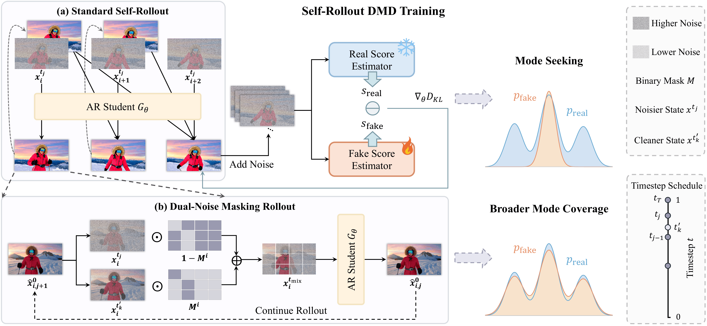

<div align="center">

<h1>Mask Forcing: Improving Autoregressive Video Diffusion Distillation via Dual-Noise Masking Rollout</h1>

[Zhuoran Zhao](https://alicezrzhao.github.io/)<sup>1,2</sup> · [Shengju Qian](http://thesouthfrog.com/about.me/)<sup>3</sup> · [Tongtong Liang](https://tongtongliang.github.io/)<sup>4</sup> · [Xianghao Kong](https://refkxh.github.io/)<sup>2</sup> · [Songchun Zhang](https://franklinz233.github.io/)<sup>2</sup> · [Junchao Huang](https://junchao-cs.github.io/)<sup>5</sup> · [Guian Fang](https://enderfga.cn/)<sup>6</sup> · [Xin Wang](https://scholar.google.com/citations?user=2Z1GJ50AAAAJ&hl=en)<sup>3</sup> · [Pan Hui](https://panhui.people.ust.hk/index.html)<sup>1,2</sup> · [Anyi Rao](https://anyirao.com/)<sup>2</sup>

<sup>1</sup>HKUST(GZ) &nbsp;·&nbsp; <sup>2</sup>HKUST &nbsp;·&nbsp; <sup>3</sup>LIGHTSPEED &nbsp;·&nbsp; <sup>4</sup>UCSD &nbsp;·&nbsp; <sup>5</sup>CUHK(SZ) &nbsp;·&nbsp; <sup>6</sup>NUS
<br/>

<p>

<a href="https://alicezrzhao.github.io/mask_forcing/"></a>
<a href="https://arxiv.org/abs/2609.09123"></a>
<a href="https://huggingface.co/Alicezrzhao/Mask-Forcing/tree/main"></a>

</p>

</div>

## 📖 Overview

Self-rollout DMD enables few-step autoregressive video generation, but its mode-seeking reverse-KL objective may concentrate the student rollout distribution on a narrow set of teacher modes. Moreover, the DMD objective is evaluated only on the completed rollout output and does not directly regularize each intermediate transition, allowing errors to accumulate through subsequent denoising steps and later chunks. Together, these limitations reduce visual quality and realism.

**Mask Forcing** introduces a Dual-Noise Masking Rollout strategy that injects cleaner tokens into noisy rollout inputs through random masks. The resulting perturbations diversify student rollout trajectories to cover more teacher modes, while cleaner tokens guide the denoising of noisier tokens to improve intermediate predictions and reduce error accumulation.

Mask Forcing requires no real-video supervision or additional post-training stages, introduces no additional network forward passes, and leaves inference unchanged.

<div align="center">

</div>


## 🎥 Demo

<div align="center">

| Sample 1 | Sample 2 |
|:---:|:---:|
| <video src="https://github.com/user-attachments/assets/a8792f6a-f07d-4f7e-a7fa-038d06b1b20d" controls width="400"></video> | <video src="https://github.com/user-attachments/assets/10bf376f-ddc4-4c0d-a087-1799100fa017" controls width="400"></video> |
| Sample 3 | Sample 4 |
| <video src="https://github.com/user-attachments/assets/aafe8d12-96f2-4872-b955-33ac7dc1b4f4" controls width="400"></video> | <video src="https://github.com/user-attachments/assets/a0109f50-08b2-40db-8deb-77f7b7c6ae93" controls width="400"></video> |
| Sample 5 | Sample 6 |
| <video src="https://github.com/user-attachments/assets/d885a9cb-1745-4c6f-9c72-f74902ba9e7b" controls width="400"></video> | <video src="https://github.com/user-attachments/assets/8dc82547-b0ea-45a9-b70d-8613e59318a3" controls width="400"></video> |

</div>

For more qualitative and quantitative comparisons, please visit our **[Project Page](https://alicezrzhao.github.io/mask_forcing/)**.

---

## 📢 News

- **[2026-09]** Paper released on [arXiv](https://arxiv.org/abs/2609.09123) and [Project Page](https://alicezrzhao.github.io/mask_forcing/) is online.
- **[2026-09]** Inference code is released.
- Training code will be released in this repository. Stay tuned.


## 📋 TODO

- [x] Release paper and project page
- [x] Release inference code and checkpoints
- [ ] Release training code


## 🚀 Quick Start

### Installation
```
conda create -n mask_forcing python=3.10 -y
conda activate mask_forcing
pip install -r requirements.txt
pip install flash-attn --no-build-isolation
python setup.py develop
```

### Download Checkpoints
```
hf download Wan-AI/Wan2.1-T2V-1.3B  --local-dir wan_models/Wan2.1-T2V-1.3B
# Mask Forcing checkpoints -> checkpoints/chunkwise/
hf download Alicezrzhao/Mask-Forcing --local-dir checkpoints
```

### Inference
```
bash inference_chunkwise.sh
```


## 🎓 Citation

If you find Mask Forcing useful in your research, please consider citing:

```bibtex
@misc{zhao2026maskforcingimprovingautoregressive,
      title={Mask Forcing: Improving Autoregressive Video Diffusion Distillation via Dual-Noise Masking Rollout}, 
      author={Zhuoran Zhao and Shengju Qian and Tongtong Liang and Xianghao Kong and Songchun Zhang and Junchao Huang and Guian Fang and Xin Wang and Pan Hui and Anyi Rao},
      year={2026},
      eprint={2609.09123},
      archivePrefix={arXiv},
      primaryClass={cs.CV},
      url={https://arxiv.org/abs/2609.09123}, 
}
```

## 🤝 Acknowledgements

This project builds upon the following outstanding open-source works:

- [Self-Forcing](https://self-forcing.github.io/) — Self-forcing training for autoregressive video diffusion
- [Causal Forcing](https://causal-forcing.github.io/) — AR teacher distillation with causal attention
- [LongLive](https://nvlabs.github.io/LongLive/) — Long-form video generation via generative extrapolation
- [Wan2.1](https://github.com/Wan-Video/Wan2.1) — Base video diffusion transformer
